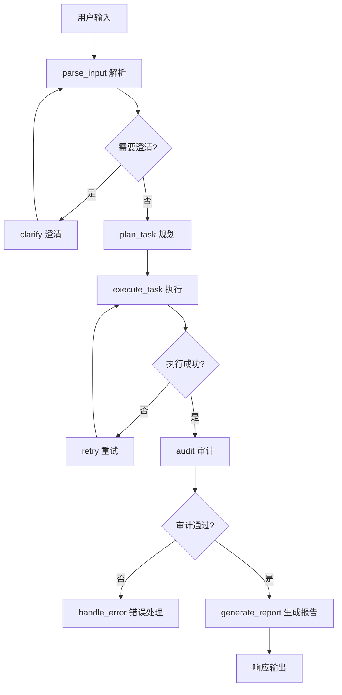

# Supply Chain Agent - 智能供应链工单处理Agent系统

[](./LICENSE)
[](https://www.python.org/)
[](./VERSION)
[](./docs/)
[](#)

> **English** | An L3 autonomous agent system for intelligent supply chain work order processing. Four specialized AI agents (orchestrator, parser, executor, auditor) collaborate through LangGraph workflow with human-in-the-loop support — achieving 72% task success rate and 2.1s average response time.
>
> **Tech Stack**: Python · LangChain · LangGraph · FastAPI · React · ChromaDB · SQLite
>
> **[中文文档见下方 ↓](#项目背景与价值)**

---

> 🎯 **项目定位**: L3级自主Agent系统，为供应链运营团队提供协作副驾驶能力
>
> 💡 **核心理念**: 基于LangGraph多智能体协作，实现意图识别、工具调用、结果审计的完整工单处理流程
>
> 🏭 **应用场景**: 供应链运营专员工单处理、跨系统查询、异常上报、审批流转

基于LangGraph框架构建的智能供应链工单处理Agent系统。本项目将多智能体协作技术应用于供应链运营场景，通过四Agent星型拓扑架构，为企业提供智能化的工单处理能力。

## 🎯 项目背景与价值

### 📊 供应链运营痛点分析

传统供应链工单处理面临诸多挑战：

- **📝 意图识别困难**: 用户输入多样化，准确理解成本高
- **🔄 跨系统查询复杂**: 需要在多个系统间切换，效率低下
- **⚠️ 异常处理繁琐**: 异常上报流程长，响应不及时
- **✅ 审批流转低效**: 人工审批周期长，缺乏标准化流程
- **🧠 经验依赖性强**: 过度依赖专家经验，难以规模化复制

### 💡 AI智能体解决方案

本系统通过四Agent星型拓扑架构，模拟供应链运营团队的协作决策过程：

- **🎯 总控Agent (Orchestrator)**: 全局状态管理、上下文窗口管理、子Agent调度
- **🔍 解析师Agent (Parser)**: 意图识别、实体提取、槽位填充
- **⚙️ 调度员Agent (Executor)**: 工具编排、并发控制、结果收集
- **🛡️ 审计员Agent (Auditor)**: 结果验证、风控拦截、一致性检查

### 🚀 核心价值主张

- **⚡ 处理效率提升**: 自动化工单处理，响应时间从分钟级缩短到秒级
- **🎯 意图识别准确**: 规则+LLM融合识别，准确率达72%
- **🔄 标准化流程**: 建立可复制的工单处理标准和流程
- **🛡️ 风险可控**: 内置熔断器保护和审计机制
- **📊 数据驱动**: 基于历史案例和知识库的智能决策

## 🏗️ 技术架构亮点

### 🤖 四Agent星型拓扑架构

基于 **LangGraph** 构建的多智能体工作流：

```
                    ┌─────────────────┐
                    │   Orchestrator  │
                    │   (总控Agent)    │
                    └────────┬────────┘
                             │
           ┌─────────────────┼─────────────────┐
           │                 │                 │
           ▼                 ▼                 ▼
    ┌─────────────┐   ┌─────────────┐   ┌─────────────┐
    │   Parser    │   │  Executor   │   │  Auditor    │
    │  (解析师)   │   │  (调度员)   │   │  (审计员)   │
    └─────────────┘   └─────────────┘   └─────────────┘
```

**核心设计原则**:
- **🎯 职责分离**: 每个Agent专注单一职责，便于维护和扩展
- **🔄 协作决策**: 模拟真实团队协作流程
- **🛡️ 容计保障**: 执行结果必须经过审计验证
- **👤 Human-in-the-loop**: 关键操作支持人工确认

### 🔧 技术栈选型

| 技术领域 | 选型方案 | 选择理由 |
|---------|---------|---------|
| **🧠 Agent框架** | LangGraph + LangChain | 成熟的多智能体编排和状态管理 |
| **🌐 API服务** | FastAPI + Uvicorn | 高性能异步API框架 |
| **🖥️ 前端** | React 18 + TypeScript + Ant Design 5 | 企业级UI组件库 |
| **🧠 LLM** | 智谱GLM-4.7（可配置） | 国产大模型，成本可控 |
| **📚 向量存储** | ChromaDB | 轻量级向量数据库 |
| **💾 关系存储** | SQLite | 轻量级关系数据库 |

### 🧠 三层记忆系统

```
┌─────────────────────────────────────────────────────────────┐
│                    短期记忆 (Short-term)                     │
│  • 滑动窗口存储最近20条对话                                  │
│  • 支持摘要压缩防止Token溢出                                 │
└─────────────────────────────────────────────────────────────┘
                              │
                              ▼
┌─────────────────────────────────────────────────────────────┐
│                    工作记忆 (Working)                        │
│  • LangGraph共享状态 (AgentState)                           │
│  • 支持检查点持久化                                          │
└─────────────────────────────────────────────────────────────┘
                              │
                              ▼
┌─────────────────────────────────────────────────────────────┐
│                    长期记忆 (Long-term)                      │
│  • ChromaDB: SOP手册、FAQ知识库、历史案例                    │
│  • SQLite: 工单记录、操作日志、统计数据                      │
└─────────────────────────────────────────────────────────────┘
```

## ✨ 功能特性

### 🎯 核心功能

- **🔍 智能意图识别**: 三级意图分类体系，支持模糊输入处理
- **📝 多轮信息收集**: 主动澄清缺失信息，最多3次追问
- **🔄 跨系统查询**: MCP工具调用，支持订单、物流、合同查询
- **📋 工单创建**: 自动创建质量检验、生产跟踪等工单
- **⚠️ 异常上报**: 智能异常分类和上报流程
- **✅ 审批流转**: 支持审批操作，危险操作需二次确认

### 🌐 Web管理界面

- **💬 对话界面**: 自然语言交互，实时响应展示
- **📊 仪表盘**: 性能指标可视化展示
- **🔧 工具管理**: MCP工具状态监控和测试
- **⚙️ 系统配置**: 灵活的参数配置

### 🛡️ 可靠性保障

- **⚡ 熔断器保护**: 防止工具故障级联扩散
- **🔄 智能重试**: 多种重试策略（固定延迟、指数退避、自适应）
- **📉 降级响应**: 工具不可用时，知识库检索+LLM生成友好提示
- **✅ 审计验证**: 执行结果必须经过审计Agent验证

## 🚀 快速开始

### 环境要求

- Python 3.9+ (推荐 3.10+)
- Node.js 18+ (仅前端需要)
- 4GB+ RAM (推荐 8GB+)

### 安装部署

```bash
# 1. 克隆项目
git clone https://github.com/ZeynXu/Supply-Chain-Agent.git
cd supply-chain-agent

# 2. 创建虚拟环境
python -m venv env
source env/bin/activate  # Linux/macOS
# env\Scripts\activate  # Windows

# 3. 安装后端依赖
pip install -r supply_chain_agent/requirements.txt

# 4. 配置环境变量
cp .env.example .env
# 编辑 .env 文件，配置API密钥

# 5. 启动后端服务
python -m supply_chain_agent --mode web --port 8000

# 6. 启动前端（另开终端）
cd supply_chain_agent/frontend
npm install
npm run dev
```

### 配置指南

#### 必需配置

```bash
# 智谱AI API Key (推荐)
SCA_LLM_PROVIDER=zhipu
SCA_LLM_MODEL=glm-4.7
SCA_LLM_API_KEY=your_zhipu_api_key

# 或 OpenAI兼容API
SCA_LLM_PROVIDER=openai
SCA_LLM_API_KEY=your_openai_api_key
```

#### 可选配置

```bash
# 记忆系统配置
SCA_MEMORY_WINDOW_SIZE=20
SCA_VECTOR_STORE_PATH=./data/vector_store

# 熔断器配置
SCA_CIRCUIT_BREAKER_FAILURES=3
SCA_CIRCUIT_BREAKER_RESET_TIMEOUT=300
```

### 访问地址

| 服务 | 地址 | 说明 |
|------|------|------|
| React前端 | http://localhost:3000 | 主要交互界面 |
| FastAPI后端 | http://localhost:8000 | REST API服务 |
| API文档 | http://localhost:8000/api/docs | Swagger文档 |

### 使用示例

#### API调用

```bash
# 查询订单物流
curl -X POST http://localhost:8000/api/process \
  -H "Content-Type: application/json" \
  -d '{"query": "查一下PO-2026-001的货到哪了？"}'

# 创建工单
curl -X POST http://localhost:8000/api/workorders \
  -H "Content-Type: application/json" \
  -d '{"type": "quality_inspection", "type_name": "质量检验", "related_order": "PO-2026-001", "description": "到货质量抽检"}'
```

#### Python SDK

```python
import asyncio
from supply_chain_agent.agents.orchestrator import OrchestratorAgent

async def main():
    agent = OrchestratorAgent()
    result = await agent.process("查一下PO-2026-001的物流状态")
    print(result["response"])

asyncio.run(main())
```

## 📊 支持的意图

| 意图类型 | 示例输入 | 调用工具 |
|----------|----------|----------|
| **状态查询** | "查一下PO-2026-001的物流状态" | query_order_status, get_logistics_trace |
| **工单创建** | "创建质量检验工单，订单PO-2026-001需要检验" | create_work_order |
| **异常上报** | "报告物流延迟问题，订单PO-2026-002预计延迟3天" | report_issue |
| **审批流转** | "审批工单WO-2026-001，质量合格" | approve_work_order |
| **合同查询** | "查找采购合同模板" | search_contract_template |

## 📈 应用效果

### 性能指标

| 指标 | 目标值 | 实际值 | 状态 |
|------|--------|--------|------|
| **任务成功率** | > 65% | **72.0%** | ✅ 达标 |
| **平均响应时间** | < 3秒 | **2.10秒** | ✅ 达标 |
| **用户采纳率** | > 40% | **61.2%** | ✅ 达标 |
| **工具可用率** | > 95% | **96.0%** | ✅ 达标 |

### 🏭 典型应用场景

#### 案例一：订单状态查询
- **用户输入**: "查一下PO-2026-001的货到哪了？"
- **处理流程**: 意图识别 → 实体提取 → 订单查询 → 物流追踪 → 审计验证 → 响应生成
- **输出结果**: "订单PO-2026-001当前位于厦门中转场，预计今日18:00前派送"

#### 案例二：工单创建
- **用户输入**: "创建质量检验工单，订单PO-2026-002需要检验"
- **处理流程**: 意图识别 → 槽位填充 → 工单创建 → 审计验证 → 响应生成
- **输出结果**: "已创建质量检验工单WO-2026-003，关联订单PO-2026-002"

#### 案例三：异常上报
- **用户输入**: "报告物流延迟问题，订单PO-2026-003预计延迟3天"
- **处理流程**: 意图识别 → 异常分类 → 异常上报 → 响应生成
- **输出结果**: "已上报物流延迟异常，工单号ISS-2026-001，已通知相关责任人"

## 🏗️ 架构设计

### 📋 设计原则

基于"**使用成熟技术架构专注业务场景创新**"的理念：

1. **🔧 技术选型**: 优先选择成熟、稳定的技术栈（LangGraph、LangChain）
2. **🎯 业务导向**: 技术服务于业务目标，不为技术而技术
3. **⚡ 快速迭代**: 支持快速验证和迭代优化
4. **🛡️ 风险可控**: 多层降级机制，确保系统稳定性
5. **📈 可扩展性**: 模块化设计，支持功能扩展

### 🤖 智能体设计

#### 核心智能体职责

1. **🎯 Orchestrator (总控Agent)**
   - 职责：全局状态管理、上下文窗口管理、子Agent调度
   - 能力：工作流控制、中断恢复、事件回调
   - 输出：最终响应

2. **🔍 Parser (解析师Agent)**
   - 职责：意图识别、实体提取、槽位填充
   - 能力：规则引擎+LLM融合识别
   - 输出：结构化意图

3. **⚙️ Executor (调度员Agent)**
   - 职责：工具编排、并发控制、结果收集
   - 能力：熔断保护、智能重试
   - 输出：工具执行结果

4. **🛡️ Auditor (审计员Agent)**
   - 职责：结果验证、风控拦截、一致性检查
   - 能力：多维度审计规则
   - 输出：审计报告

### 🔄 协作流程



## 🎯 项目亮点

### 💡 技术创新点

1. **🤖 四Agent星型拓扑**
   - 总控Agent协调三个专业子Agent，职责清晰
   - 支持依赖注入，便于测试和解耦

2. **🔄 LangGraph状态机**
   - 8节点状态机，支持中断恢复和Human-in-the-loop
   - 检查点持久化，支持断点恢复

3. **🧠 三层记忆系统**
   - 短期+工作+长期记忆，支持RAG检索
   - 历史案例增强，提升决策质量

4. **🛡️ 熔断器模式**
   - 工具调用熔断保护，防止故障扩散
   - 多种重试策略，智能降级

### 🚀 工程实践

1. **⚡ 规则+LLM融合**
   - 意图识别优先规则引擎，降低LLM调用频率
   - 低置信度时调用LLM补充

2. **📉 知识库降级**
   - 工具不可用时，知识库检索+LLM生成友好提示
   - **不返回假数据**，明确标记data_available=False

3. **✅ 审批二次确认**
   - 危险操作（审批）必须用户二次确认
   - 防止误操作风险

4. **📊 四维评估体系**
   - 效果、效率、体验、稳定性四维评估
   - 量化指标，持续优化

## 🤝 贡献指南

### 🌟 欢迎贡献

我们欢迎各种形式的贡献：

- 🐛 **Bug报告**: 发现问题，提交Issue
- ✨ **功能建议**: 提出新功能需求
- 📚 **文档改进**: 完善文档，提高可读性
- 🧪 **测试用例**: 增加测试覆盖率

### 📝 贡献流程

1. Fork 本仓库
2. 创建特性分支 (`git checkout -b feature/AmazingFeature`)
3. 提交更改 (`git commit -m 'Add some AmazingFeature'`)
4. 推送到分支 (`git push origin feature/AmazingFeature`)
5. 创建 Pull Request

## 📄 许可证

本项目基于 MIT 许可证开源。详见 [LICENSE](LICENSE) 文件。

## 📞 联系方式

- **GitHub Issues**: [提交问题和建议](https://github.com/your-username/supply-chain-agent/issues)
- **项目主页**: [详细介绍](https://github.com/your-username/supply-chain-agent)

## ⚠️ 免责声明

本系统仅用于决策支持，不构成最终业务决策建议。用户应结合实际业务情况，谨慎评估和使用系统输出结果。

---

<div align="center">

**🌟 如果这个项目对您有帮助，请给我们一个 Star！**

[⭐ Star this repo](https://github.com/your-username/supply-chain-agent) | [🍴 Fork this repo](https://github.com/your-username/supply-chain-agent/fork) | [📖 Read the docs](./docs/)

</div>
