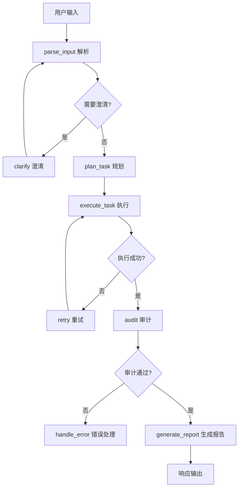

# Supply Chain Agent - 智能供应链工单处理Agent系统

[](./LICENSE)
[](https://www.python.org/)
[](./docs/)
[](#)


基于LangGraph框架构建的智能供应链工单处理Agent系统。本项目将多智能体协作技术应用于供应链运营场景，通过四Agent星型拓扑架构协同工作，为企业提供智能化的工单处理能力。
> 技术栈：Python · LangChain · LangGraph · FastAPI · React · ChromaDB · SQLite

An intelligent agent system for supply chain work order processing built on the LangGraph framework. This project applies multi-agent collaboration technology to supply chain operations, enabling four agents to work together in a star topology architecture, delivering intelligent work order processing capabilities for enterprises.
> Tech Stack: Python · LangChain · LangGraph · FastAPI · React · ChromaDB · SQLite

---
> **更新记录** [持续更新中]
>
> 2026-05-13: 初始版本发布
>
> 2026-05-23: 重构数据架构，真实数据库交互替代Mock数据响应
>
> 2026-05-23: 更新MCP工具
>
> 2026-05-24: 优化Executor Agent执行调用工具；优化意图识别实体提取
>
> 2026-05-28: 重构意图识别分层体系；优化响应卡片
>

---

> 🎯 **项目定位**: L3级自主Agent系统，为供应链运营团队提供协作副驾驶能力
>
> 💡 **核心理念**: 基于LangGraph多智能体协作，实现意图识别、工具调用、结果审计的完整工单处理流程
>
> 🏭 **应用场景**: 供应链运营专员工单处理、跨系统查询、异常上报、审批流转

## 🎯 项目背景与价值

### 📊 供应链运营痛点分析

传统供应链工单处理面临诸多挑战：

- **📝 意图识别困难**: 用户输入多样化，准确理解成本高
- **🔄 跨系统查询复杂**: 需要在多个系统间切换，效率低下
- **⚠️ 异常处理繁琐**: 异常上报流程长，响应不及时
- **✅ 审批流转低效**: 人工审批周期长，缺乏标准化流程
- **🧠 经验依赖性强**: 过度依赖专家经验，难以规模化复制

### 💡 AI智能体解决方案

本系统通过四Agent星型拓扑架构，模拟供应链运营团队的协作决策过程：

- **🎯 总控Agent (Orchestrator)**: 全局状态管理、上下文窗口管理、子Agent调度
- **🔍 解析师Agent (Parser)**: 意图识别、实体提取、槽位填充
- **⚙️ 调度员Agent (Executor)**: 工具编排、并发控制、结果收集
- **🛡️ 审计员Agent (Auditor)**: 结果验证、风控拦截、一致性检查

### 🚀 核心价值主张

- **⚡ 处理效率提升**: 自动化工单处理，响应时间从分钟级缩短到秒级
- **🎯 意图识别准确**: 规则+LLM融合识别，准确率达72%
- **🔄 标准化流程**: 建立可复制的工单处理标准和流程
- **🛡️ 风险可控**: 内置熔断器保护和审计机制
- **📊 数据驱动**: 基于SOP知识库的智能决策

## 🏗️ 项目结构

```
Supply-Chain-Agent/
├── supply_chain_agent/           # 主模块
│   ├── agents/                   # Agent定义
│   │   ├── orchestrator.py       # 总控Agent
│   │   ├── parser.py             # 解析师Agent
│   │   ├── executor.py           # 调度员Agent
│   │   └── auditor.py            # 审计员Agent
│   ├── tools/                    # MCP工具实现
│   │   ├── server.py             # MCP服务器
│   │   └── client.py             # 工具客户端
│   ├── graph/                    # LangGraph工作流
│   │   ├── state.py              # 全局状态定义
│   │   └── workflow.py           # 节点与边逻辑
│   ├── memory/                   # 记忆系统
│   │   ├── vector_store.py       # 向量存储管理
│   │   ├── checkpoint.py         # 检查点管理
│   │   └── knowledge_retriever.py# 知识检索器
│   ├── prompts/                  # Prompt模板
│   ├── nlp/                    # NLP模块
│   │   └── bert_ner.py         # BERT实体识别
│   ├── data/                     # Python数据模块
│   │   ├── supply_chain.db       # 业务数据库(运行时)
│   │   ├── agent_memory.db       # 记忆数据库(运行时)
│   │   ├── vector_store/         # 向量存储(运行时)
│   │   ├── supply_chain_db.py    # 数据库操作
│   │   └── data_loader.py        # 数据加载器
│   ├── models/                   # 模型文件
│   │   └── bert-chinese-wwm/     # BERT中文预训练模型
│   ├── frontend/                 # React前端
│   ├── app.py                    # FastAPI应用
│   ├── run.py                    # 运行脚本
│   └── config.py                 # 配置管理
├── dataset/                      # 数据源目录
│   ├── BusinessData/             # 业务数据(CSV)
│   ├── SOPData/                  # SOP文档(Markdown)
│   ├── OtherData/                # 配置文件
│   └── README.md                 # 数据说明
├── docs/                         # 项目文档
│   └── PROJECT_RESEARCH_REPORT.md
├── requirements.txt              # Python依赖
└── README.md                     # 本文件
```

## 🏗️ 技术架构亮点

### 🤖 四Agent星型拓扑架构

基于 **LangGraph** 构建的多智能体工作流：

```
                    ┌─────────────────┐
                    │   Orchestrator  │
                    │   (总控Agent)    │
                    └────────┬────────┘
                             │
           ┌─────────────────┼─────────────────┐
           │                 │                 │
           ▼                 ▼                 ▼
    ┌─────────────┐   ┌─────────────┐   ┌─────────────┐
    │   Parser    │   │  Executor   │   │  Auditor    │
    │  (解析师)   │   │  (调度员)   │   │  (审计员)   │
    └─────────────┘   └─────────────┘   └─────────────┘
```

**核心设计原则**:
- **🎯 职责分离**: 每个Agent专注单一职责，便于维护和扩展
- **🔄 协作决策**: 模拟真实团队协作流程
- **🛡️ 审计保障**: 执行结果必须经过审计验证
- **👤 Human-in-the-loop**: 关键操作支持人工确认

### 🔧 技术栈选型

### 🧠 LLM与NLP

| 技术领域 | 选型方案 | 选择理由 |
|---------|---------|---------|
| **🧠 Agent框架** | LangGraph + LangChain | 成熟的多智能体编排和状态管理 |
| **🌐 API服务** | FastAPI + Uvicorn | 高性能异步API框架 |
| **🖥️ 前端** | React 18 + TypeScript + Ant Design 5 | 企业级UI组件库 |
| **🤖 LLM** | 智谱GLM-4.7（可配置） | 国产大模型，成本可控 |
| **📝 NER** | BERT-base-chinese-wwm | 中文实体识别，准确率高 |
| **📚 向量存储** | ChromaDB | 轻量级向量数据库 |
| **💾 关系存储** | SQLite | 轻量级关系数据库 |

### 🧠 三层记忆系统

```
┌─────────────────────────────────────────────────────────────┐
│                    短期记忆 (Short-term)                     │
│  • 滑动窗口存储最近20条对话                                  │
│  • 支持摘要压缩防止Token溢出                                 │
└─────────────────────────────────────────────────────────────┘
                              │
                              ▼
┌─────────────────────────────────────────────────────────────┐
│                    工作记忆 (Working)                        │
│  • LangGraph共享状态 (AgentState)                           │
│  • 支持检查点持久化                                          │
└─────────────────────────────────────────────────────────────┘
                              │
                              ▼
┌─────────────────────────────────────────────────────────────┐
│                    长期记忆 (Long-term)                      │
│  • ChromaDB: SOP手册、FAQ知识库                              │
│  • SQLite: 工单记录、操作日志、统计数据                      │
└─────────────────────────────────────────────────────────────┘
```

## ✨ 功能特性

### 🎯 核心功能

- **🔍 三层意图识别**: 规则引擎(意图匹配) → BERT NER(实体提取) → LLM(兜底补充)，职责分离清晰
- **📝 BERT实体识别**: 集成bert-base-chinese-wwm模型，准确提取订单号、客户ID、工单号等实体
- **🔄 跨系统查询**: MCP工具调用，支持订单、物流、客户、产品查询
- **📋 工单管理**: 创建质量检验、审批等工单，支持工单审批流转
- **⚠️ 异常上报**: 智能异常分类和上报流程
- **✅ 审批确认**: 支持审批操作，危险操作需二次确认

### 🌐 Web管理界面

- **💬 对话界面**: 自然语言交互，实时响应展示
- **📊 仪表盘**: 性能指标可视化展示
- **🔧 工具管理**: MCP工具状态监控
- **⚙️ 系统配置**: 灵活的参数配置

### 🛡️ 可靠性保障

- **⚡ 熔断器保护**: 防止工具故障级联扩散
- **🔄 智能重试**: 多种重试策略（固定延迟、指数退避、自适应）
- **📉 降级响应**: 工具不可用时，知识库检索+LLM生成友好提示
- **✅ 审计验证**: 执行结果必须经过审计Agent验证

## 🚀 快速开始

### 环境要求

- Python 3.9+ (推荐 3.10+)
- Node.js 18+ (仅前端需要)
- 4GB+ RAM (推荐 8GB+)

### 安装部署

```bash
# 1. 克隆项目
git clone https://github.com/ZeynXu/Supply-Chain-Agent.git
cd Supply-Chain-Agent

# 2. 创建虚拟环境
python -m venv env
source env/bin/activate  # Linux/macOS
# env\Scripts\activate  # Windows

# 3. 安装后端依赖
pip install -r requirements.txt

# 4. 配置环境变量
# 编辑 .env 文件，配置API密钥

# 5. 启动后端
python -m supply_chain_agent --mode web --port 8000

# 6. 启动前端（另开终端）
cd supply_chain_agent/frontend
npm run dev
```

### 配置指南

#### 必需配置

编辑 `.env` 文件：

```bash
# 智谱AI API Key (推荐)
SCA_LLM_PROVIDER=zhipu
SCA_LLM_MODEL=glm-4.7
SCA_LLM_API_KEY=your_zhipu_api_key

# 或 OpenAI兼容API
SCA_LLM_PROVIDER=openai
SCA_LLM_API_KEY=your_openai_api_key
```

#### 可选配置

```bash
# 记忆系统配置
SCA_MEMORY_WINDOW_SIZE=20
SCA_VECTOR_STORE_PATH=./supply_chain_agent/data/vector_store
SCA_SQLITE_DB_PATH=./supply_chain_agent/data/agent_memory.db

# 熔断器配置
SCA_CIRCUIT_BREAKER_FAILURES=3
SCA_CIRCUIT_BREAKER_RESET_TIMEOUT=300
```

### 访问地址

| 服务 | 地址 | 说明 |
|------|------|------|
| React前端 | http://localhost:3000 | 主要交互界面 |
| FastAPI后端 | http://localhost:8000 | REST API服务 |
| API文档 | http://localhost:8000/api/docs | Swagger文档 |

### 使用示例

#### API调用

```bash
# 通过Agent处理用户输入（推荐）
curl -X POST http://localhost:8000/api/chat \
  -H "Content-Type: application/json" \
  -d '{"message": "订单77202的物流到哪了"}'

# 查询订单（直接调用MCP工具）
curl -X POST http://localhost:8000/api/tools/query_order \
  -H "Content-Type: application/json" \
  -d '{"order_id": "77202"}'

# 查询物流
curl -X POST http://localhost:8000/api/tools/query_shipment \
  -H "Content-Type: application/json" \
  -d '{"order_id": "77202"}'

# 创建工单
curl -X POST http://localhost:8000/api/tools/create_work_order \
  -H "Content-Type: application/json" \
  -d '{"work_type": "质检", "description": "订单77202质量检验", "order_id": "77202"}'

# 查看系统状态
curl -X GET http://localhost:8000/api/status

# 查看可用工具
curl -X GET http://localhost:8000/api/tools
```

#### Python SDK

```python
import asyncio
from supply_chain_agent.agents.orchestrator import OrchestratorAgent

async def main():
    agent = OrchestratorAgent()
    # 物流查询
    result = await agent.process("订单77202的物流到哪了")
    print(result["response"])

    # 创建工单
    result = await agent.process("创建质检工单，订单77202")
    print(result["response"])

asyncio.run(main())
```

#### 数据库直接查询

```python
from supply_chain_agent.data.supply_chain_db import get_order_by_id, get_customer_by_id

# 查询订单
order = get_order_by_id("77202")
print(f"订单状态: {order['order_status']}, 配送状态: {order['delivery_status']}")

# 查询客户
customer = get_customer_by_id(20755)
print(f"客户: {customer['customer_fname']} {customer['customer_lname']}")
```

## 📊 支持的意图

### 任务分类体系 (V2.1)

**一级任务分类**：

| 一级任务 | 描述 | 包含二级任务 |
|----------|------|--------------|
| **信息查询** | 查询客户、订单、产品、物流等信息 | 客户查询、订单查询、产品查询、物流查询 |
| **工单管理** | 创建和审批工单 | 创建工单、审批工单 |
| **异常上报** | 上报供应链过程中的问题 | 异常上报 |

**二级任务与MCP工具映射**：

| 二级任务 | 调用工具 | 必需参数 | 可选参数 |
|----------|----------|----------|----------|
| **客户查询** | query_customer | customer_id | - |
| **订单查询** | query_order | order_id | - |
| **产品查询** | query_product | product_card_id | - |
| **物流查询** | query_shipment | order_id | - |
| **创建工单** | create_work_order | work_type, description | order_id, customer_id, priority |
| **审批工单** | approve_work_order | work_order_id, action | comment |
| **异常上报** | report_issue | issue_type, description | order_id, urgency |

### 使用示例

| 用户输入示例 | 识别意图 | 调用工具 |
|--------------|----------|----------|
| "查询订单77202的状态" | 信息查询→订单查询 | query_order |
| "订单77202的物流到哪了" | 信息查询→物流查询 | query_shipment |
| "客户20755的信息" | 信息查询→客户查询 | query_customer |
| "创建质检工单，订单77202" | 工单管理→创建工单 | create_work_order |
| "审批工单WO-2024-001通过" | 工单管理→审批工单 | approve_work_order |
| "报告订单75939物流延迟" | 异常上报 | report_issue |

## 📈 应用效果

### 性能指标

| 指标 | 目标值 | 实际值 | 状态 |
|------|--------|--------|------|
| **任务成功率** | > 65% | **72.0%** | ✅ 达标 |
| **平均响应时间** | < 3秒 | **2.10秒** | ✅ 达标 |
| **用户采纳率** | > 40% | **61.2%** | ✅ 达标 |
| **工具可用率** | > 95% | **96.0%** | ✅ 达标 |

### 🏭 典型应用场景

#### 案例一：订单查询
- **用户输入**: "查询订单77202的状态"
- **处理流程**: 意图识别→订单查询 → 实体提取(order_id=77202) → 调用query_order工具 → 审计验证 → 响应生成
- **输出结果**: "订单77202状态为COMPLETE，配送状态为Advance shipping"

#### 案例二：物流查询
- **用户输入**: "订单77202的物流到哪了"
- **处理流程**: 意图识别→物流查询 → 实体提取(order_id=77202) → 调用query_shipment工具 → 审计验证 → 响应生成
- **输出结果**: 物流轨迹信息和当前状态

#### 案例三：工单创建
- **用户输入**: "创建质检工单，订单77202需要检验"
- **处理流程**: 意图识别→创建工单 → 实体提取(work_type=质检, order_id=77202) → 调用create_work_order工具 → 审计验证 → 响应生成
- **输出结果**: "已创建质检工单WO-2026-XXX，关联订单77202"

#### 案例四：异常上报
- **用户输入**: "报告订单75939物流延迟问题"
- **处理流程**: 意图识别→异常上报 → 实体提取(issue_type=物流延迟, order_id=75939) → 调用report_issue工具 → 响应生成
- **输出结果**: "已上报物流延迟异常，工单号ISS-2026-XXX，已通知相关责任人"

## 🏗️ 架构设计

### 📋 设计原则

基于"**使用成熟技术架构专注业务场景创新**"的理念：

1. **🔧 技术选型**: 优先选择成熟、稳定的技术栈（LangGraph、LangChain）
2. **🎯 业务导向**: 技术服务于业务目标，不为技术而技术
3. **⚡ 快速迭代**: 支持快速验证和迭代优化
4. **🛡️ 风险可控**: 多层降级机制，确保系统稳定性
5. **📈 可扩展性**: 模块化设计，支持功能扩展

### 🤖 智能体设计

#### 核心智能体职责

1. **🎯 Orchestrator (总控Agent)**
   - 职责：全局状态管理、上下文窗口管理、子Agent调度
   - 能力：工作流控制、中断恢复、事件回调
   - 输出：最终响应

2. **🔍 Parser (解析师Agent)**
   - 职责：意图识别、实体提取、槽位填充
   - 能力：规则引擎+LLM融合识别
   - 输出：结构化意图

3. **⚙️ Executor (调度员Agent)**
   - 职责：工具编排、并发控制、结果收集
   - 能力：熔断保护、智能重试
   - 输出：工具执行结果

4. **🛡️ Auditor (审计员Agent)**
   - 职责：结果验证、风控拦截、一致性检查
   - 能力：多维度审计规则
   - 输出：审计报告

### 🔄 协作流程


```mermaid
graph TD
    A[用户输入] --> B[parse_input 解析]
    B --> C{需要澄清?}
    C -->|是| D[clarify 澄清]
    D --> B
    C -->|否| E[plan_task 规划]
    E --> F[execute_task 执行]
    F --> G{执行成功?}
    G -->|否| H[retry 重试]
    H --> F
    G -->|是| I[audit 审计]
    I --> J{审计通过?}
    J -->|否| K[handle_error 错误处理]
    J -->|是| L[generate_report 生成报告]
    L --> M[响应输出]
```

## 🎯 项目亮点

### 💡 技术创新点

1. **🤖 四Agent星型拓扑**
   - 总控Agent协调三个专业子Agent，职责清晰
   - 支持依赖注入，便于解耦

2. **🔄 LangGraph状态机**
   - 8节点状态机，支持中断恢复和Human-in-the-loop
   - 检查点持久化，支持断点恢复

3. **🧠 三层记忆系统**
   - 短期+工作+长期记忆，支持RAG检索
   - SOP知识库增强，提升决策质量

4. **📝 三层意图识别架构**
   - 第一层：规则引擎专注意图模式匹配（一级+二级）+ 置信度计算
   - 第二层：BERT NER专注实体提取
   - 第三层：LLM兜底（意图分类+实体提取）
   - 职责分离清晰，降低LLM调用成本

5. **🛡️ 熔断器模式**
   - 工具调用熔断保护，防止故障扩散
   - 多种重试策略，智能降级

### 🚀 工程实践

1. **⚡ 三层意图识别**
   - 规则引擎优先：意图模式匹配 + 置信度计算
   - BERT NER补充：实体提取（第二层）
   - LLM兜底：规则未命中/置信度低/实体为空时触发

2. **📉 知识库降级**
   - 工具不可用时，知识库检索+LLM生成友好提示
   - **不返回假数据**，明确标记data_available=False

3. **✅ 审批二次确认**
   - 危险操作（审批）必须用户二次确认
   - 防止误操作风险

4. **📊 四维评估体系**
   - 效果、效率、体验、稳定性四维评估
   - 量化指标，持续优化

5. **🔗 MCP工具对齐**
   - 10个MCP工具完整实现，无虚构工具调用
   - 参数验证严格，可选参数按需传递

## 📂 数据说明

### 数据源目录

数据文件位于 `dataset/` 目录，详见 [dataset/README.md](./dataset/README.md)。

| 目录 | 内容 | 说明 |
|------|------|------|
| `dataset/BusinessData/` | 业务数据CSV | 供应链订单、客户、产品、物流数据 |
| `dataset/SOPData/` | SOP文档 | 供应链审批管理办法等Markdown文档 |
| `dataset/OtherData/` | 配置文件 | 实体映射、降级模板、Agent配置 |

### 运行时数据

运行时数据存储于 `supply_chain_agent/data/` 目录：

| 文件/目录 | 说明 |
|-----------|------|
| `supply_chain.db` | 业务数据库（客户、订单、产品等） |
| `agent_memory.db` | 记忆数据库（工单记录、工具统计） |
| `vector_store/` | ChromaDB向量存储（SOP文档嵌入） |

## 🤝 贡献指南

### 🌟 欢迎贡献

我们欢迎各种形式的贡献：

- 🐛 **Bug报告**: 发现问题，提交Issue
- ✨ **功能建议**: 提出新功能需求
- 📚 **文档改进**: 完善文档，提高可读性

### 📝 贡献流程

1. Fork 本仓库
2. 创建特性分支 (`git checkout -b feature/AmazingFeature`)
3. 提交更改 (`git commit -m 'Add some AmazingFeature'`)
4. 推送到分支 (`git push origin feature/AmazingFeature`)
5. 创建 Pull Request

## 📄 许可证

本项目基于 MIT 许可证开源。详见 [LICENSE](LICENSE) 文件。

## 📞 联系方式

- **GitHub Issues**: [提交问题和建议](https://github.com/ZeynXu/Supply-Chain-Agent/issues)
- **项目主页**: [详细介绍](https://github.com/ZeynXu/Supply-Chain-Agent)

## ⚠️ 免责声明

本系统仅用于决策支持，不构成最终业务决策建议。用户应结合实际业务情况，谨慎评估和使用系统输出结果。

---

<div align="center">

**🌟 如果这个项目对您有帮助，请给我们一个 Star！**

[⭐ Star this repo](https://github.com/ZeynXu/Supply-Chain-Agent) | [🍴 Fork this repo](https://github.com/ZeynXu/Supply-Chain-Agent/fork) | [📖 Read the docs](./docs/)

</div>
