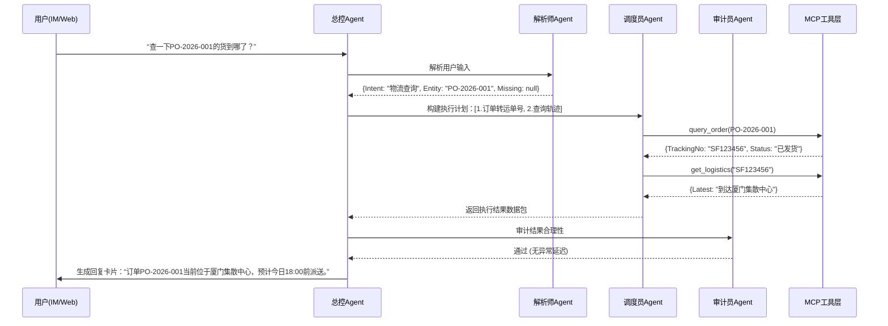

### **智能供应链工单处理Agent系统 - 详细设计方案 V2.0**

**文档状态：** 详细设计评审稿
**作者：** 资深Agent产品经理

### 1. 产品定位与用户画像 (细化)

为了确保Agent的行为符合预期，我们必须明确其服务对象和协作模式。

- **产品定位**：供应链运营团队的**协作副驾驶**。当前阶段定位为 **L3级自主Agent**，即在明确规则和高置信度场景下自主执行，边缘场景和异常情况主动请求人工接管。
- **核心用户画像**：
    - **供应链运营专员 (主要用户)**：每日处理大量重复性工单。**核心痛点**：登录多个系统（ERP查库存、TMS查轨迹、OA查合同）切换繁琐，复制粘贴易出错。**核心诉求**：一句话吩咐下去，拿到准确结果。
    - **IT运维/系统管理员 (次要用户)**：负责维护Agent连接的各类系统工具。**核心诉求**：清晰的工具调用日志、故障时的快速定位能力、Agent行为的安全可控。

### 2. 详细功能模块设计 (细化与调整)

在原设计基础上，补充具体的交互细节和边界条件。

| 模块 | 原设计简述 | **详细设计深化** |
| :--- | :--- | :--- |
| **意图识别** | 复用NER + LLM分类 | **细化**：建立 **三级意图分类体系**。一级意图：`工单创建`、`状态查询`、`审批流转`、`异常上报`。二级意图关联实体：如`状态查询` -> `订单状态`、`物流状态`。三级意图关联槽位：如`订单状态` -> `[订单号]`、`[客户名称]`。若关键槽位缺失，触发 **主动澄清**。 |
| **多轮信息收集** | LangGraph循环节点 | **细化**：增加 **澄清策略配置**。例如，同一工单内最多主动提问3次，避免陷入无限循环。提供 **快捷回复按钮**（在Demo UI中模拟企业IM）以提升澄清效率。 |
| **跨系统查询** | MCP工具调用 | **细化**：增加 **工具调用预热与降级机制**。调用前检查MCP Server健康状态；若主数据源（如ERP）超时，自动降级查询备用只读库或缓存，并在报告中标注“数据可能存在延迟”。 |
| **报告生成** | 结构化输出 | **细化**：设计 **多模态输出卡片**。输出不仅是Markdown文本，而是包含：1) **处理结论** (一句话总结) 2) **关键数据卡片** (订单金额、物流状态图标) 3) **下一步建议** (如“确认无误可点击审批”或“建议联系承运商电话xxx”)。 |
| **异常处理** | 重试、目标对齐 | **细化**：引入 **熔断机制**。同一工具3秒内连续失败3次，暂停该工具的调用权限5分钟，并通知管理员。增加 **兜底话术模板**，当所有路径失败时，给出友好的人工引导。 |

### 3. 核心协作流程设计 (新增)

这是Agent系统的灵魂，定义清楚Agent之间如何“踢皮球”。

#### 3.1 协作状态机 (基于LangGraph)

我们将原有的三Agent架构细化为一个带**总控中心**的星型拓扑结构。

- **总控Agent (新增)**：负责维护全局状态 `State`，管理上下文窗口，决定唤醒哪个子Agent。
- **子Agent (微调后的定位)**：
    - **解析师 (原规划Agent)**：专注语言理解与任务拆解。
    - **调度员 (原执行Agent)**：专注工具编排与并发控制。
    - **审计员 (原校验Agent)**：专注结果比对与风控拦截。

#### 3.2 工单处理时序图



### 4. 记忆系统与状态管理设计 (核心难点突破)

这是Agent长期稳定运行的关键。

| 记忆类型 | 存储结构设计 | **工程化细节** |
| :--- | :--- | :--- |
| **短期记忆** | `List[Message]` | **策略**：不仅存对话，还存**操作记录**。用户可见：“正在查询订单...”，后台记录：`{role: "tool", content: "query_order..."}`。采用**滑动窗口+摘要压缩**防止Token溢出。 |
| **工作记忆** | `TypedDict` (LangGraph State) | **定义**：`{messages, user_intent, extracted_slots, task_queue, final_report, error_count}`。所有Agent共享此状态，读写互斥。 |
| **长期记忆** | Milvus向量库 + SQLite记录 | **向量库**：存《工单处理SOP手册》、《常见异常处理FAQ》。**关系库**：存工单ID与处理结果的映射，用于RAG的**少样本示例召回**。 |

### 5. MCP工具集详细定义

为了模拟真实企业环境，我们设计一套标准的企业内部API Mock。

| 工具名称 | 功能描述 | **输入参数 (JSON Schema)** | **输出模拟示例** |
| :--- | :--- | :--- | :--- |
| `query_order_status` | 查询采购订单详情 | `{"order_id": "string"}` | `{"order_id": "...", "status": "待收货", "amount": 12500.0, "supplier": "XX科技"}` |
| `get_logistics_trace` | 查询物流轨迹 | `{"tracking_no": "string"}` | `{"tracking_no": "...", "status": "运输中", "current_location": "厦门中转场", "eta": "2026-04-23"}` |
| `search_contract_template` | 检索合同条款 | `{"query": "string", "top_k": 2}` | `{"templates": [{"title": "质量保证协议", "content": "..."}]}` |
| `approve_work_order` | **危险操作-提交审批** | `{"order_id": "string", "comment": "string"}` | **严格设计**：Agent调用此工具仅生成**预填单**，必须返回给用户二次确认，**不得**直接提交。 |

### 6. 评估体系升级 (从数据到业务)

在原指标基础上，增加业务维度的评估。

| 指标维度 | 指标名称 | **计算公式 / 评估方法** | 目标值 (V1.0) |
| :--- | :--- | :--- | :--- |
| **效果指标** | 任务成功率 | (成功完成意图的工单数 - 需要人工介入的工单数) / 总工单数 | > 65% |
| **效率指标** | 平均首次响应时长 | 用户发出指令到Agent给出有效反馈的时间 | < 3秒 |
| **体验指标** | **用户采纳率 (新增)** | 用户点击“采纳建议”或“一键审批”的次数 / Agent生成建议的总次数 | > 40% |
| **稳定性指标** | 工具调用不可用率 | 由于参数错误或API故障导致的调用失败比例 | < 5% |

### 7. 技术实现与部署路线图

**7.1 核心代码结构建议**

```text
supply_chain_agent/
├── agents/                 # Agent定义
│   ├── orchestrator.py     # 总控
│   ├── parser.py
│   ├── executor.py
│   └── auditor.py
├── tools/                  # MCP Mock实现
│   ├── server.py           # 启动MCP服务
│   └── mock_data/          # 模拟数据源
├── graph/                  # LangGraph图定义
│   ├── state.py            # 全局状态结构
│   └── workflow.py         # 节点与边逻辑
├── memory/                 # 记忆模块
│   ├── vector_store.py
│   └── checkpoint.py
└── app.py                  # FastAPI/Gradio入口
```

**7.2 分阶段落地计划 (MVP思维)**

- **Phase 1: 单链路跑通 (2周)**
    - 目标：`查询订单状态` 这一条意图的端到端自动化。
    - 产物：CLI命令行版本的Agent，能正确调用Mock API并返回结果。

- **Phase 2: 多智能体编排 (2周)**
    - 目标：接入LangGraph，实现解析 -> 执行 -> 审计的图结构流转。增加`物流查询`意图。
    - 产物：可处理2种意图的Web Demo (Gradio界面)。

- **Phase 3: 记忆与容错 (1周)**
    - 目标：加入向量库RAG检索历史案例，完善异常重试与降级机制。
    - 产物：系统稳定性报告，包含上下文溢出测试数据。

- **Phase 4: 评估与发布 (1周)**
    - 目标：跑通100条标准测试集，产出量化评估报告，准备答辩PPT。

### 8. 产品经理的特别备注：

有几个**加分项**建议在实现时可以留意：

1.  **可视化调试面板**：在Gradio界面或单独的Debug页面，实时展示LangGraph的**状态流转图**。点开这个图，直观展示Agent当前的思维链，效果拔群。
2.  **刻意设计的“失败”案例**：准备一个演示路径，专门展示Agent如何处理错误。例如故意输入一个不存在的单号，看Agent如何利用审计员识别异常，并优雅地回复用户。
3.  **埋点设计**：虽然Mock，但在代码中预留OpenTelemetry的埋点代码。“我考虑了生产可观测性”是高级工程师的思维体现。