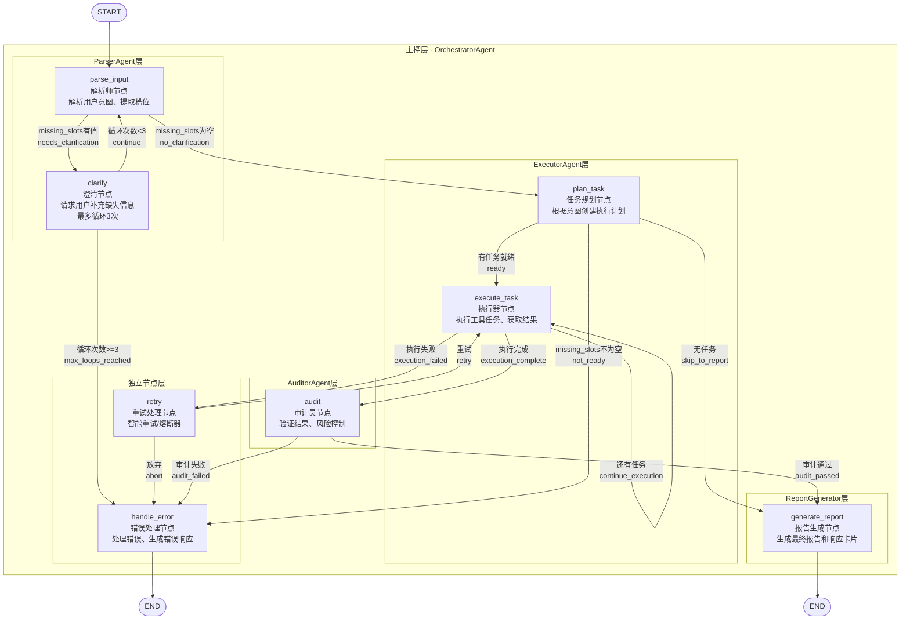

# Supply Chain Agent Workflow 架构图

本文档描述了智能供应链工单处理Agent系统的工作流图结构。

## Agent分层架构

系统采用主从式多Agent架构，包含1个主Agent（Orchestrator）和4个子Agent：

| 层级 | Agent | 职责 |
|------|-------|------|
| 主控层 | OrchestratorAgent (编排者) | 工作流编排、Agent协调、状态管理 |
| 子Agent层 - ParserAgent | ParserAgent (解析师) | 意图解析、实体提取、槽位填充、澄清请求 |
| 子Agent层 - ExecutorAgent | ExecutorAgent (调度员) | 任务规划、工具执行、结果收集 |
| 子Agent层 - AuditorAgent | AuditorAgent (审计员) | 结果验证、风险控制、质量检查 |
| 子Agent层 - ReportGenerator | ReportGenerator (报告生成器) | 报告生成、响应卡片构建 |

## 完整流程图（分层视图）



## 节点与Agent对应关系

| 节点名称 | 函数名 | 所属Agent | 中文名称 | 职责描述 |
|---------|--------|-----------|---------|---------|
| parse_input | parse_input_node | ParserAgent | 解析师节点 | 解析用户意图，提取实体和槽位信息 |
| clarify | clarify_node | ParserAgent | 澄清节点 | 请求用户补充缺失信息，最多循环3次后跳转错误处理 |
| plan_task | plan_task_node | ExecutorAgent | 任务规划节点 | 根据意图类型创建工具执行计划 |
| execute_task | execute_task_node | ExecutorAgent | 执行器节点 | 执行工具任务，支持多任务顺序执行 |
| retry | retry_node | - (独立) | 重试处理节点 | 智能重试机制和熔断器保护 |
| audit | audit_node | AuditorAgent | 审计员节点 | 验证执行结果，进行风险控制 |
| generate_report | generate_report_node | ReportGenerator | 报告生成节点 | 生成最终报告和多模态响应卡片 |
| handle_error | handle_error_node | - (独立) | 错误处理节点 | 处理各类错误，生成用户友好的错误响应 |

## 条件边说明

### parse_input → clarify / plan_task

| 条件 | 目标节点 | 判断逻辑 |
|------|---------|---------|
| needs_clarification | clarify | missing_slots 列表不为空 |
| no_clarification | plan_task | missing_slots 列表为空 |

### clarify → parse_input / handle_error

| 条件 | 目标节点 | 判断逻辑 |
|------|---------|---------|
| continue | parse_input | clarification_loop_count < 3 |
| max_loops_reached | handle_error | clarification_loop_count >= 3 |

### plan_task → execute_task / handle_error / generate_report

| 条件 | 目标节点 | 判断逻辑 |
|------|---------|---------|
| ready | execute_task | user_intent 存在且 task_queue 不为空 |
| not_ready | handle_error | missing_slots 不为空 |
| skip_to_report | generate_report | task_queue 为空 |

### execute_task → execute_task / audit / retry

| 条件 | 目标节点 | 判断逻辑 |
|------|---------|---------|
| continue_execution | execute_task | task_queue 不为空，还有任务 |
| execution_complete | audit | task_queue 为空，所有任务完成 |
| execution_failed | retry | 执行出错且 error_count < 3 |

### retry → execute_task / handle_error

| 条件 | 目标节点 | 判断逻辑 |
|------|---------|---------|
| retry | execute_task | should_retry = True |
| abort | handle_error | should_retry = False |

### audit → generate_report / handle_error

| 条件 | 目标节点 | 判断逻辑 |
|------|---------|---------|
| audit_passed | generate_report | audit_results.passed = True |
| audit_failed | handle_error | audit_results.passed = False |

## 关键流程路径

### 1. 正常处理流程
```
用户输入 → parse_input → plan_task → execute_task → audit → generate_report → END
```

### 2. 需要澄清的流程
```
parse_input → clarify → (用户输入) → parse_input → ...
                ↓ (循环3次后)
            handle_error → END
```

### 3. 执行失败重试流程
```
execute_task → retry → execute_task (重试)
                    ↓ (重试失败)
              handle_error → END
```

### 4. 达到最大澄清次数流程
```
clarify (第3次) → handle_error → END
```

## Agent职责详解

### OrchestratorAgent (编排者) - 主控层
- 管理工作流整体状态
- 协调各子Agent的调用
- 维护共享的Agent实例
- 处理跨Agent的数据流转

### ParserAgent (解析师) - 意图理解层
**节点**: parse_input, clarify
- 解析用户自然语言输入
- 提取意图类型和实体信息
- 识别缺失的必填槽位
- 生成澄清问题获取缺失信息

### ExecutorAgent (调度员) - 任务执行层
**节点**: plan_task, execute_task
- 根据意图类型创建执行计划
- 按顺序执行工具调用
- 收集工具执行结果
- 处理执行过程中的异常

### AuditorAgent (审计员) - 质量控制层
**节点**: audit
- 验证执行结果的正确性
- 进行风险控制和合规检查
- 确保数据完整性
- 生成审计报告

### ReportGenerator (报告生成器) - 输出层
**节点**: generate_report
- 汇总各阶段处理结果
- 生成结构化报告
- 构建用户友好的响应卡片
- 支持多模态输出格式

### 独立节点
**节点**: retry, handle_error
- 不属于特定Agent
- 提供工作流级别的通用功能
- 错误处理和重试机制
